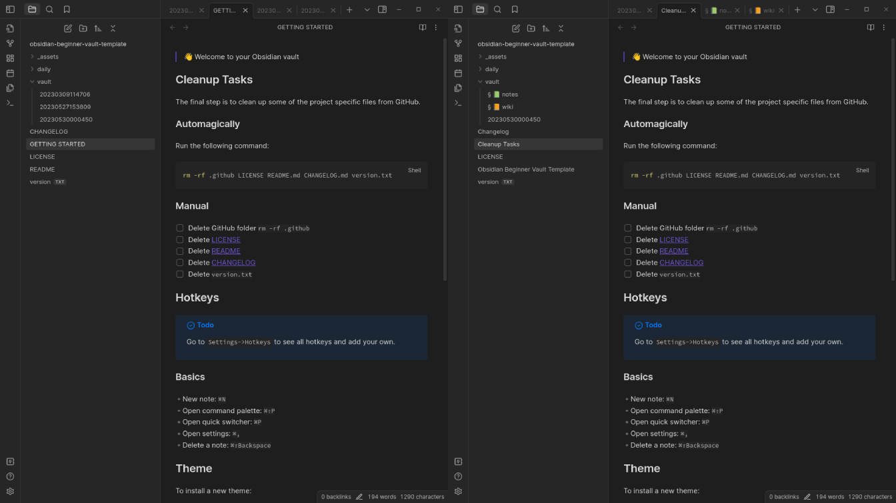

# Headings Overhaul Plugin

Obsidian events supports dynamically adding and removing listeners (https://docs.obsidian.md/Reference/TypeScript+API/Events/Events). The on() function returns a EventRef that you can store and later pass into offref() to remove the listener.

*BRUH, I just reinvented this by making my own EventEmitter. That is it, I need a break.*

---

> **Warning**
> This codebase is currently under heavy development, and should not be used.
> However, if you'd like to work with this codebase instead. I'd recommend inspecting the following commit(s): [b527](https://github.com/mournfully/replace-title-with-header/commit/b52745f7ea6a2309132494a0f3b660dd645d521f), [ef62](https://github.com/mournfully/replace-title-with-header/commit/ef62319ef3d0fd04bca5f80d94f5e477107b4a65)



I found the following thread [^1] on the obsidian forum and all the recommended plugins to be quite helpful when I first encountered this problem.

I used `front-matter-title` [^2] for a long time, until I grew frustrated trying with it's codebase. I especially struggled trying to integrate the provided api (`front-matter-title-api-provider`) with `omnisearch` [^3]. 

I wasn't able to make much progress with `front-matter-title`, but I did manage to get somewhat close with just `omnisearch`. I added `headings1` to the type `ResultNote`, after realizing that it would be automatically populated by `IndexedDocument`. Then I just changed how titles were rendered by using `note.headings1` instead of `note.basename`. 

[obsidian-omnisearch/ResultItemVault.svelte · scambier/obsidian-omnisearch · GitHub](https://github.com/scambier/obsidian-omnisearch/blob/master/src/components/ResultItemVault.svelte)
```diff
  export let note: ResultNote
  let title = ''

  $: {
-   title = note.basename
+   title = note.headings1
    notePath = pathWithoutFilename(note.path)
    if (settings.ignoreDiacritics) {
      title = removeDiacritics(title)
    }
  }
```

[obsidian-omnisearch/globals.ts at master · scambier/obsidian-omnisearch · GitHub](https://github.com/scambier/obsidian-omnisearch/blob/master/src/globals.ts)
```diff
export type ResultNote = {
  score: number
  path: string
  basename: string
+ headings1: string  
  content: string
  foundWords: string[]
  matches: SearchMatch[]
}
```

For a myriad of reasons that I can't be bothered to go over here. The approach above was quite naive and couldn't work as I wanted. So, I've chosen to write my own plugin, and to borrow heavily from the `omnisearch` codebase (mostly cause I like the way it's designed).

---

Now that I've confirmed that it's possible to use the obsidian api to print the first suggested result from `[[title#heading]]`. I suppose I could just query the api directly from `omnisearch` and use it's caching system as well. But, then I'd still have to keep `front-matter-title` to render headings over filenames everywhere else.

So, I think I'll continue work here. I plan on indexing and caching the first heading of all `*.md` files while respecting obsidian's excluded files. As well as, creating listeners to (re)cache new or updated files. 

Afterwards, I'll have to somehow display the results as needed. And create an api which would take in `path` (folder/example.md) and resolve `heading` ('example heading`).

hotreload plugin [^4]

[^1]: [Use H1 or front-matter title instead of or in addition to filename as display name - Feature requests - Obsidian Forum](https://forum.obsidian.md/t/use-h1-or-front-matter-title-instead-of-or-in-addition-to-filename-as-display-name/687/125)

[^2]: [snezhig/obsidian-front-matter-title: Plugin for Obsidian.md](https://github.com/snezhig/obsidian-front-matter-title)

[^3]: [scambier/obsidian-omnisearch: A search engine that "just works" for Obsidian. Includes OCR and PDF indexing.](https://github.com/scambier/obsidian-omnisearch)

[^4]: [pjeby/hot-reload: Automatically reload Obsidian plugins in development when their files are changed](https://github.com/pjeby/hot-reload)
